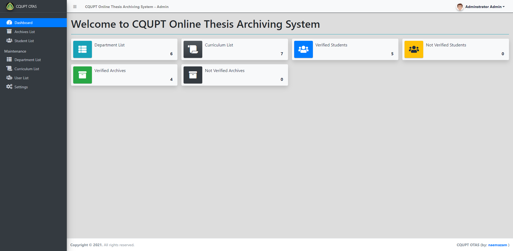

<p align="center">
  
  
  <h1 align="center">CQUPT Online Thesis Archiving System</h1>
  <p align="center"> </p>
</p> 

This is a web-based application that provides an online platform for storing the students' thesis or capstone projects. The main purpose of this application is to give the students of a certain university or College Schools online access to store their final year projects and allow lower year students to find some references and ideas for their future or upcoming final year project. The system was written in PHP/OOP (Object-Oriented Programming) and has multiple features and functionalities that are related to this kind of system. This has user-friendly functionalities and a pleasant user interface using the Bootstrap Framework and AdminLTE Template.


This Online Thesis Archiving System has 2 modules which are the Management Module and the Student Module:


The  **Management Module**  is the part of the system where the school management can manage the system information and important list on the system. The said module can be accessed by 2 types of user roles which are the  **Administrator**  and  **Staff**  user. The  **Admin Users**  has full access to all features and functionalities of the system  **Admin Panel**  and that includes the list of  **Staff users**. The  **Staff Users** only have limited access to the said system side. They can only manage the submitted projects of the students and manage the registered student list.


The  **Student Module**  is the side of the system where the students can explore, find references, read the archive's contents, and more. The students can simply register their system credentials. After they register their system account, the management will verify his/her account and if the admin has successfully verified the student account, the student will have permission to submit the project but still be upon approval of the management. He/She can also update the project he/she submitted. They can also list his/her own submitted projects whether it was published to the public or not.



The system also has some features that can help or can give the end-users a better experience while using the system. The project list has a pagination feature and a search feature.

## What It can DO?

### Management Side

-   **Secure Login and Logout**
-   **Dashboard**
-   **Manage Department List (CRUD)**
-   **Manage Course/Curriculum List (CRUD)**
-   **Manage Archives**
    -   List All Projects Submitted by the students
    -   View the project details
    -   Publish the project to the Public
    -   Unpublish project to the Public
    -   Delete Client
-   **Manage Student Accounts**
    -   List Student Accounts
    -   View Student Details
    -   Verify Student System Account
    -   Delete Student Account
-   **Manage Users list (CRUD)**
-   **Manage Account Details/Credentials**
-   **Manage System Information**

### Student/Public Side

-   **Secure Login and Registration**
-   **Home Page**  _(displays the website's welcome message)_
-   **Submit Thesis/Capstone Project**
-   **Project List**
    -   List All Published Projects
    -   List All Published Projects Per Department
    -   List All Published Projects Per Curriculum
    -   The list has a pagination feature
    -   Published Project View Page
    -   Edit Project Details  _(if the logged-in user is the one who submits)_
    -   Delete Project  _(if the logged-in user is the one who submits)_
-   **Profile**
    -   Display the Student System Information
    -   Update Student Details/Credentials
    -   List/Manage Submitted Projects
-   **Search Project**
-   **Update Account Information/Credentials**
-   **Logout**


## Requirements

-   **Download** and  **Install** any **local web server**  such as  **XAMPP/WAMP.**

## Download
```bash 
git clone https://github.com/naemazam/Online-Thesis-Archiving-System.git
```
Renamed It **otas**

## Installation

1.  **Open** your  **XAMPP/WAMP's Control Panel**  and start ****Apache****  and  ****MySQL****.
2.  If you are using  **XAMPP**,  **copy** the extracted downloaded  folder and  **paste** it into the **XAMPP's "htdocs" directory**. And If you are using  **WAMP**,  **paste** it into the  **"www" directory.**
3.  **Browse** the  ****PHPMyAdmin**** in a  **browser**. i.e.  ****http://localhost/phpmyadmin****
4.  **Create** a  **new database**  naming  ****otas_db****.
5.  **Import** the provided  ****SQL**** file. The file is known as ****otas_db.sql****  located inside the  **database**  folder.
6.  **Browse** the  **Online Thesis Archiving System**  in a  **browser**. i.e.  ****http://localhost/otas/****


## Admin Access Information

Username: admin

Password: admin123

## User Guide 


